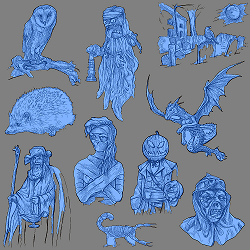
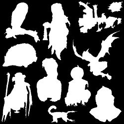
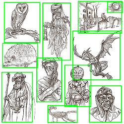

# image-sheet-segmentation-tool

## Tool Description
This tool can be used to perform basic figure or character segmentation and extraction from line-style artwork sheet. The tool is based-on classical image processing (without deep-learning) methods. The tool processes input image of line-style artwork / drawing containing figures / characters and create segmented invidual image of character and save it in specified output directory. The tool can also create segmentation mask binary image, original image blended with segmentation mask and original image embedded with bounding boxes on detected characters. 

<picture>
  
</picture>
<picture>
  
</picture>
<picture>
  
</picture>


## Requirements
This tool requires Python 3.9+ or later versions. The required libraries can be installed by running the following command.
```sh
pip install -r ./requirements.txt
```

## Objects Extraction
Extract objects/characters in single image file or directory containing multiple image files. The resulting image files will be writen to subdirectory (with the same name as input file / directory) in `./output`. In addition, the file `output.json` is also created. The `output.json` file contains input file hash, input file name, input image size, number of objects detected (bounding box) and list containing properties of each bounding box (width, height, origin, center).

### Example Usage 1: Extracting Objects from Single Image File
* Extract the characters from image file `./test-images/test1.jpg` and write the resulting image files in automatically created directory `./output/test1/`. 

```sh
python ExtractCharacter.py --input_path='test-images/test1.jpg' --shade_overlap 
```

* or with complete arguments and option as follows.

```sh
python ExtractCharacter.py --input_path='test-images/test1.jpg' --out_dir=./output --pad_factor=0.1 --j_thres=3, --s_thres=7 --min_size=500 --shade_overlap
```

### Example Usage 2: Extracting Objects from Multiple Image Files in a Directory
* Extract the characters from multiple image files in directory `./test-images/images/` and write the resulting image files in automatically created directory `./output/images/`. 

```sh
python ExtractCharacter.py --input_path='test-images/images/' --shade_overlap 
```

* or with complete arguments and option as follows.

```sh
python ExtractCharacter.py --input_path='test-images/images/' --out_dir=./output --pad_factor=0.1 --j_thres=3, --s_thres=7 --min_size=500 --shade_overlap
```

### CLI Arguments and Options
* `input_path` _[string]_ - _[required]_ - Path to input file
* `out_dir` _[string]_ - Directory for writing output files. This default to `.output/`
* `pad_factor` _[float]_ - _[default=0.1]_ - Padding (extension) factor for bounding box and output image. The valid value is 0.0 (no extension) to 1.0 (extend the segmentation size 100% from original bounding box proposal for all detected characters. 
* `--j_thres` _[int]_ - _[default=3]_ - Join threshold for adjusting the integration level of individual characters / object. Increase this value if the tool fails to segment large characters / objects or if the drawing lines is too faint. The valid value is 3 to 15.
* `--s_thres` _[int]_ - _[default=7]_ - Separation threshold for adjusting the separation level of neighboring characters / object. Increase this value if the tool fails to segment characters / objects that is close one to another. The valid value is 3 to 15.
* `--min_size` _[int]_ - _[default=500]_ - Minimum size in square pixels for characters to be segmented.
* `--shade_overlap` - Option to shade out / remove overlap leftover. This is used to remove neighboring characters / objects left-over in each individual output image by masking it with white pixels. This can be useful if the characters / objects is close one to another or there is unwanted pixels around individual characters like captions, numbers, etc.


## Create Segmentation Mask Binary Image
Create objects segmentation mask binary image from single image file or directory containing multiple image files. The results will be writen to subdirectory (with the same name as input file / directory) in `./output`. In addition, the file `output.json` is also created. The `output.json` file contains input file hash, input file name, input image size, number of objects detected (bounding box) and list containing properties of each bounding box (width, height, origin, center).

### Example Usage 3: Create Segmentation Mask Binary Image from Single Image File

* Create segmentation mask binary image from image file`./test-images/test3.jpg` and write the results in automatically created directory `./output/test3/` directory. 

```sh
python SegmentCharacter.py --input_path='test-images/test3.jpg'
```

* In addition, `--bbox` and `--blend` option can be used to create original image embedded with bounding boxes and original image blended with segmentation mask respectively. The resulting image files will be writen in `./output` directory. 

```sh
python SegmentCharacter.py --input_path='test-images/test3.jpg' --bbox --blend
```

### Example Usage 4: Create Segmentation Mask Binary Image from Multiple Image Files in a Directory

* Create segmentation mask binary image from multiple image files in directory `./test-images/images/` and write the results in automatically created directory `./output/images/` directory. 

```sh
python SegmentCharacter.py --input_path='test-images/images/'
```

* In addition, `--bbox` and `--blend` option can be used to create original image embedded with bounding boxes and original image blended with segmentation mask respectively. 

```sh
python SegmentCharacter.py --input_path='test-images/images/' --bbox --blend
```

### CLI Arguments and Options
* `input_path` _[string]_ - _[required]_ - Path to input file
* `out_dir` _[string]_ - Directory for writing output files. This default to `.output/`
* `pad_factor` _[float]_ - _[default=0.1]_ - Padding (extension) factor for bounding box and output image. The valid value is 0.0 (no extension) to 1.0 (extend the segmentation size 100% from original bounding box proposal for all detected characters. 
* `--j_thres` _[int]_ - _[default=3]_ - Join threshold for adjusting the integration level of individual characters / object. Increase this value if the tool fails to segment large characters / objects or if the drawing lines is too faint. The valid value is 3 to 15.
* `--s_thres` _[int]_ - _[default=7]_ - Separation threshold for adjusting the separation level of neighboring characters / object. Increase this value if the tool fails to segment characters / objects that is close one to another. The valid value is 3 to 15.
* `--min_size` _[int]_ - _[default=500]_ - Minimum size in square pixels for characters to be segmented.
* `--bbox` - Option to create original image embedded with bounding boxes on segmented characters / objects.
* `--blend` - Option to create original image blended with segmentation mask.
